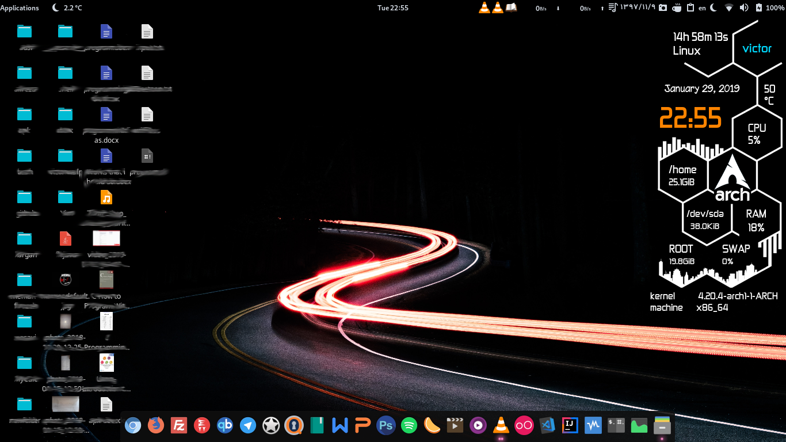
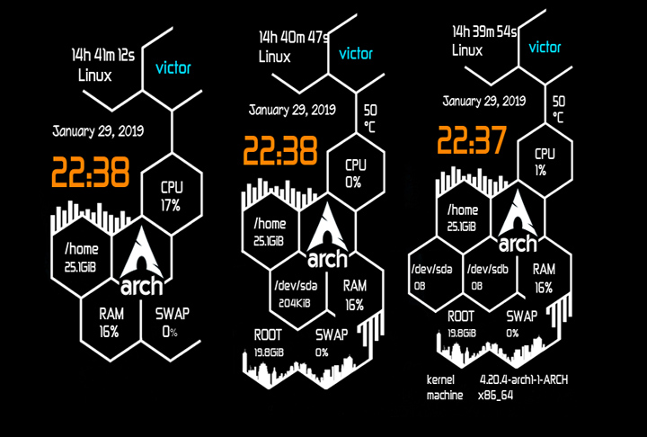
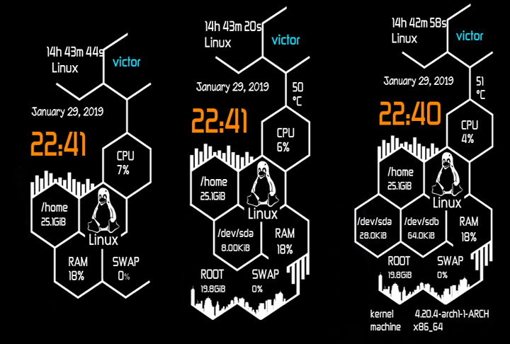
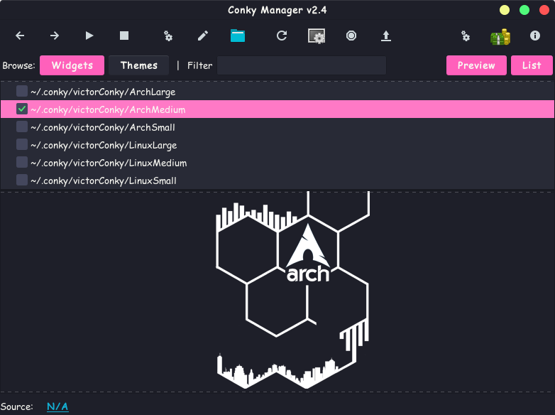

<div align="center" class="tip" markdown="1" style>


</div>

# victorconky
conky for conkymanager

This conky has three sizes for your usage and two type for arch linux distributation and other linux distributations

The widgets in this package are:

* archSmall
* archMedium
* archLarge
* linuxSmall
* linuxMedium
* linuxLarg

<div align="center" class="tip" markdown="1" style>




</div>

To use the widget set below, you can use two methods to install:
1. Install with installer script (Tested on gnome)
2. Manual confinement (recomended)

I recomend the second method (manual configurations)

> **Note**: First of all, make sure the `conky-manager` is installed

The first method:
Run the installer script

The second method:

1.Download the whole repository and Install fonts inside the fonts folder

Copy the victorConky folder to this path

```
~/.conky 
```
now you can choos your favorite conky from conky-manager software

<div align="center" class="tip" markdown="1" style>


</div>
